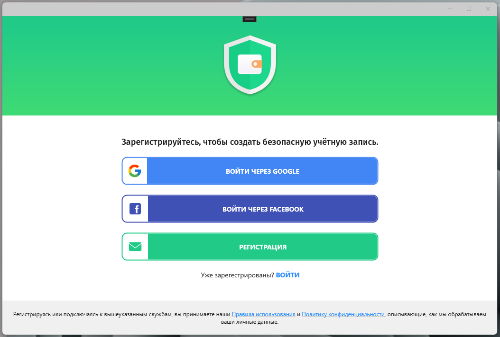
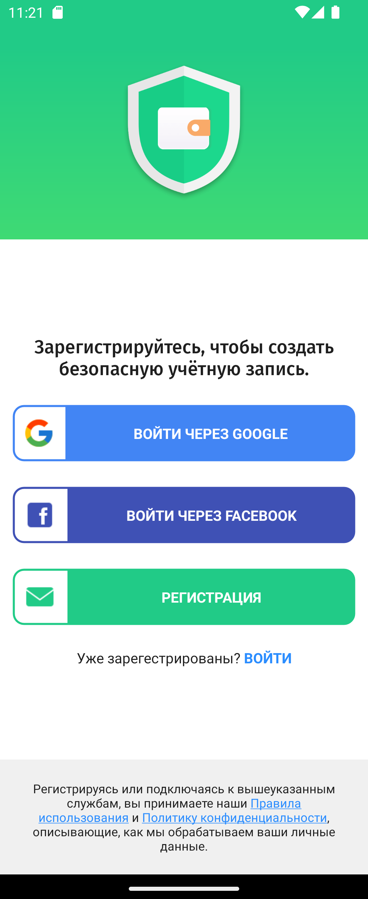

# My Wallet

## Программа контроля за финансами

За основу дизайна и функциональности взята программа [Wallet (GooglePlay)](https://play.google.com/store/apps/details?id=com.droid4you.application.wallet).

В качестве UI-фреймворка используется [.NET MAUI](https://learn.microsoft.com/ru-ru/dotnet/maui/what-is-maui?view=net-maui-7.0)

Проект создавался в качестве проверки функциональности, возможностей и изучения проблем, возникающих при использовании .NET MAUI.

---

> ***В разработке в свободное время)***

---

- Desktop 

- Mobile (Android)

